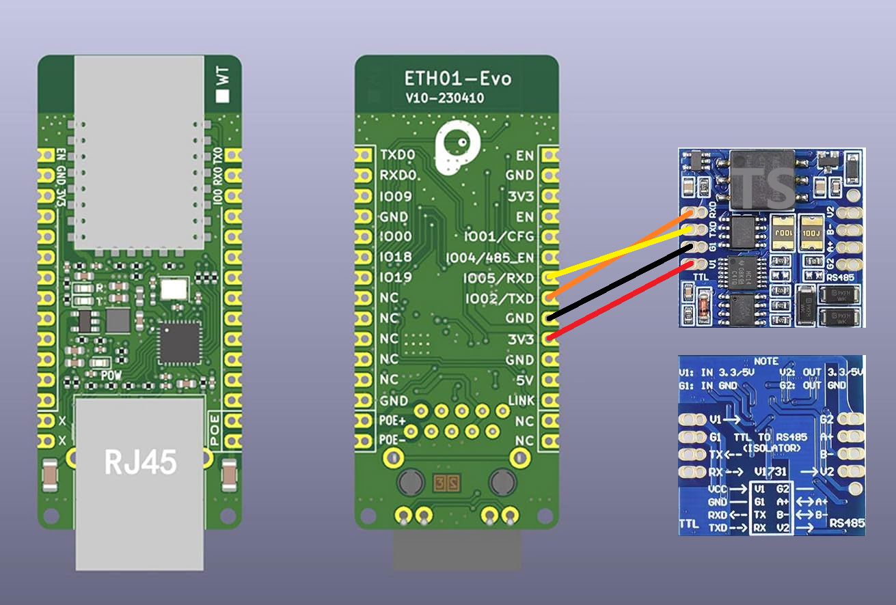

# Welcome to my second project!

Hi!
This is Imanol82.
Here you have my second project.
With this project we can connect any Baxi/Dietrich/Remeha Aerothermal with Home Assistant using an ESP32. 
For this we will need the GTW-08 that converts the RBus into Modbus.

My system has 2 Zones. Zone 1 is the HVAC and Zone 2 is the DHW

It is the same system that I used in my first project, but changing the Modbus-TCP for an ESP32.

Over time we will complete it more.

Thanks!

# Version 0.2:
The idea is to use both the DHW and the Air Conditioning in manual mode, and use the Home Assistant scheduler to make programs, raise and lower the temperatures...

So I have changed the yaml to the minimum parameters that I think are interesting and I have configured a new dashboard.
The next thing will be to create 2 climate entities, one for the air conditioning and the other for the DHW.


Thank you!

######################

# New version 1.0:
I have made the jump to version 1.0 because I think the system is already finished (except for small errors).

What has changed in this version:
- Two Climate entities have been added, one for DHW and the other for Heating/Cooling.
- For the configuration of the climate entity of the heating/cooling, I have used the Dual Mode Generic Thermostat entity that you will find on the following website: https://github.com/zacs/ha-dualmodegeneric
- The code has been divided into several files.

How I intend to use it:

The Baxi system will always be in manual mode.
Using the Home Assistant scheduler addon, I will schedule when I want the system to turn on or off or when I want the temperature to change.

An example of the scheduler:


An example of the dashboard:


The climates working:

[](https://www.youtube.com/watch?v=U0JB0XBZ2y4)


Thank you!

######################

-----------------------------------------------------------------------------------------------------------------------------------

# Installation:

First of all you need a GTW-08 gateway to convert the RBus signal to Modbus:


To read the Modbus signal, I will use an ESP32 with the typical TTL to RS485 reader.
I have used an ESP32 ETH POE, but any will work.:


The wiring diagram:




Now we will only have to create the ESP32 in ESPHome.

# - ESP32.yaml:
```
#This ESP32 device comes from Imanol82's GitHub project.
#Instructions for use can be found on github: https://github.com/Imanol82/Baxi-Dietrich-Remeha-to-Home-Assistant-with-an-ESP32
#Thank you very much!

substitutions:
  settings_skipped_updates: "30"
  devicename: "baxi_esp"

esphome:
  name: $devicename

esp32:
  board: esp32-c3-devkitm-1
  variant: esp32c3
  framework:
    type: esp-idf
    version: latest
#    platform_version: 6.5.0

external_components:
  - source: 
      type: git
      url: https://github.com/esphome/esphome
      ref: d5bdf2575c151abfad39b6c24c3856395a7d0901
    components:
      - ethernet

# Enable logging
logger:

# Enable Home Assistant API
api:
  encryption:
    key: "niWJ1FLNtf3pFq2BAKeFOwJXO56nZ/NrcNRFrqbGvAQ="

ota:
  - platform: esphome
    password: "7ac0bf8f303c4e6af4692bb3ba1d0d6a"

ethernet:
  id: my_network
  type: DM9051 # W5500
  clk_pin: 7
  mosi_pin: 10
  miso_pin: 3
  cs_pin: 9
  interrupt_pin: 8
  reset_pin: 6
  clock_speed: 20MHz
  manual_ip:
    static_ip: 192.168.178.115
    gateway: 192.168.178.1
    subnet: 255.255.255.0
    dns1: 192.168.178.1

time:
  - platform: homeassistant
    id: homeassistant_time
     
uart:
  id: mod_bus
  tx_pin: GPIO2
  rx_pin: GPIO5
  baud_rate: 9600
  stop_bits: 1

modbus:
  id: baxi_esp_modbus
#  flow_control_pin: 5
 
modbus_controller:
  - id: $devicename
    address: 0x64
    modbus_id: baxi_esp_modbus
    setup_priority: -10
    update_interval: "15s"
    command_throttle: "50ms"


##############################  ENTITIES  ##############################


##############################  SENSORS  ###############################


sensor:

  - platform: modbus_controller                       #272 PowerActualReceived
    modbus_controller_id: $devicename
    name: "Potencia de Salida Real"   
    address: 272
    register_type: holding
    value_type: U_WORD
    unit_of_measurement: "%"
    accuracy_decimals: 2
    device_class: power_factor
    state_class: measurement
    filters:
      - multiply:  1

  - platform: modbus_controller                       #384 varApTOutside 
    modbus_controller_id: $devicename
    name: "AM027 T. Exterior"   
    address: 384
    register_type: holding
    value_type: S_WORD
    unit_of_measurement: "°C"
    accuracy_decimals: 2
    device_class: temperature
    state_class: measurement
    filters:
      - multiply:  0.01

  - platform: modbus_controller                       #403 varHpHeatPumpTF
    modbus_controller_id: $devicename
    name: "HM001 T. Ida Bomba"   
    id: hm001_t_ida_bomba
    address: 403
    register_type: holding
    value_type: S_WORD
    unit_of_measurement: "°C"
    accuracy_decimals: 2
    device_class: temperature
    state_class: measurement
    filters:
      - multiply:  0.01

  - platform: modbus_controller                       #404 varHpHeatPumpTR
    modbus_controller_id: $devicename
    name: "HM002 T. Retorno Bomba"  
    id: hm002_t_retorno_bomba
    address: 404
    register_type: holding
    value_type: S_WORD
    unit_of_measurement: "°C"
    accuracy_decimals: 2
    device_class: temperature
    state_class: measurement
    filters:
      - multiply:  0.01

  - platform: modbus_controller                       #405 varApInternalSetpoint
    modbus_controller_id: $devicename
    name: "AM101 Cons. Interna"   
    address: 405
    register_type: holding
    value_type: U_WORD
    unit_of_measurement: "°C"
    accuracy_decimals: 2
    device_class: temperature
    state_class: measurement
    filters:
      - multiply:  0.01

  - platform: modbus_controller                       #409 varApWaterPressure
    modbus_controller_id: $devicename
    name: "AM019 Presion de Agua"   
    address: 409
    register_type: holding
    value_type: U_WORD
    unit_of_measurement: "bar"
    accuracy_decimals: 2
    device_class: pressure
    state_class: measurement
    filters:
      - multiply:  0.1

  - platform: modbus_controller                       #410 varApFlowmeter
    modbus_controller_id: $devicename
    name: "AM056 Caudal"   
    id: am056_caudal
    address: 410
    register_type: holding
    value_type: U_WORD
    unit_of_measurement: "L/min"
    accuracy_decimals: 2
    device_class: volume_flow_rate
    state_class: measurement
    filters:
      - multiply:  0.01

  - platform: modbus_controller                       #433 varApChEnergyConsumption
    modbus_controller_id: $devicename
    name: "AC005 Energia CC"   
    address: 433
    register_type: holding
    value_type: U_DWORD
    unit_of_measurement: "kWh"
    accuracy_decimals: 2
    device_class: energy
    state_class: measurement
    filters:
      - multiply:  1

  - platform: modbus_controller                       #435 varApDhwEnergyConsumption
    modbus_controller_id: $devicename
    name: "AC006 Energia ACS"   
    address: 435
    register_type: holding
    value_type: U_DWORD
    unit_of_measurement: "kWh"
    accuracy_decimals: 2
    device_class: energy
    state_class: measurement
    filters:
      - multiply:  1

  - platform: modbus_controller                       #437 varApCoolingEnergyConsumption
    modbus_controller_id: $devicename
    name: "AC007 Energia AACC"   
    address: 437
    register_type: holding
    value_type: U_DWORD
    unit_of_measurement: "kWh"
    accuracy_decimals: 2
    device_class: energy
    state_class: measurement
    filters:
      - multiply:  1

  - platform: modbus_controller                       #1104 varZoneTRoom
    modbus_controller_id: $devicename
    name: "CM030 T. Ambiente"   
    id: cm030_t_ambiente
    address: 1104
    register_type: holding
    value_type: S_WORD
    unit_of_measurement: "°C"
    accuracy_decimals: 1
    device_class: temperature
    state_class: measurement
    filters:
      - multiply:  0.1

  - platform: modbus_controller                       #1631 varDhwTankTemperature
    modbus_controller_id: $devicename
    name: "DM001 T. Tanque ACS"   
    id: dm001_t_tanque_acs
    address: 1631
    register_type: holding
    value_type: S_WORD
    unit_of_measurement: "°C"
    accuracy_decimals: 2
    device_class: temperature
    state_class: measurement
    filters:
      - multiply:  0.01

  - platform: template
    name: "ΔT." 
    unit_of_measurement: "°C"
    accuracy_decimals: 2
    device_class: temperature
    state_class: measurement
    lambda: |-
      return (id(hm001_t_ida_bomba).state - id(hm002_t_retorno_bomba).state);

  - platform: template
    name: "Potencia Termica" 
    unit_of_measurement: "W"
    accuracy_decimals: 1
    device_class: power
    state_class: measurement
    lambda: |-
      return (id(am056_caudal).state * 60 * (id(hm001_t_ida_bomba).state - id(hm002_t_retorno_bomba).state) / 0.86);


##############################  BINARY SENSORS  ########################


binary_sensor:

  - platform: modbus_controller                       #1110 varZonePumpRunning
    modbus_controller_id: $devicename
    name: "CM050 Bomba de CC"
    address: 1110
    register_type: holding


##############################  SWITCH  ################################


switch:

  - platform: modbus_controller                       #500 parApChEnabled
    modbus_controller_id: $devicename
    name: "AP016 Habilitar Climatizacion"
    id: ap016_habilitar_climatizacion
    address: 500
    register_type: holding
    use_write_multiple: True
    bitmask: 1
    
  - platform: modbus_controller                       #501 parApDhwEnabled
    modbus_controller_id: $devicename
    name: "AP017 Habilitar ACS"
    id: ap017_habilitar_acs
    address: 501
    register_type: holding
    use_write_multiple: True
    bitmask: 1
    
  - platform: modbus_controller                       #503 parApCoolingForced
    modbus_controller_id: $devicename
    name: "AP015 Habilitar AACC"
    id: ap015_habilitar_aacc
    address: 503
    register_type: holding
    use_write_multiple: True
    bitmask: 1
    
  - platform: modbus_controller                       #0 Heater DUMB
    modbus_controller_id: $devicename
    name: "Heater DUMB"
    id: heater_dumb
    address: 0
    register_type: holding
    use_write_multiple: True
    bitmask: 0
    
  - platform: modbus_controller                       #0 Heater DUMB
    modbus_controller_id: $devicename
    name: "Cooler DUMB"
    id: cooler_dumb
    address: 0
    register_type: holding
    use_write_multiple: True
    bitmask: 0


##############################  NUMBER  ################################


number:

  - platform: modbus_controller                       #386 parApSummerWinter
    modbus_controller_id: $devicename
    name: "AP073 T.ext. Apagar CC"
    address: 386
    use_write_multiple: false
    unit_of_measurement: "°C"
    device_class: temperature
    min_value: 15
    max_value: 30.5
    step: 0.5
    value_type: U_WORD 
    multiply: 100

  - platform: modbus_controller                       #387 parApNeutralBandSummerWinter
    modbus_controller_id: $devicename
    name: "AP075 T.ext. Apagar AACC"
    address: 387
    use_write_multiple: false
    unit_of_measurement: "°C"
    device_class: temperature
    min_value: 0
    max_value: 10
    step: 0.5
    value_type: U_WORD 
    multiply: 100

  - platform: modbus_controller                       #388 parApNeutralBandSummerWinter
    modbus_controller_id: $devicename
    name: "AP080 T.ext. Antihielo"
    address: 388
    use_write_multiple: false
    unit_of_measurement: "°C"
    device_class: temperature
    min_value: -30
    max_value: 20
    step: 0.5
    value_type: S_WORD 
    multiply: 100

  - platform: modbus_controller                       #664 parZoneRoomManualSetpoint
    modbus_controller_id: $devicename
    name: "CP200 T.cons. Manual"
    address: 664
    use_write_multiple: false
    unit_of_measurement: "°C"
    device_class: temperature
    min_value: 5
    max_value: 30
    step: 0.5
    value_type: U_WORD 
    multiply: 10

  - platform: modbus_controller                       #672 parZoneTFlowSetpointMax
    modbus_controller_id: $devicename
    name: "CP000 T.cons. Ida"
    address: 672
    use_write_multiple: false
    unit_of_measurement: "°C"
    device_class: temperature
    min_value: 7
    max_value: 100
    step: 0.5
    value_type: U_WORD 
    multiply: 100

  - platform: modbus_controller                       #673 parZoneTFlowCoolingMixingSetpoint
    modbus_controller_id: $devicename
    name: "CP270 T.cons. AACC"
    address: 673
    use_write_multiple: false
    unit_of_measurement: "°C"
    device_class: temperature
    min_value: 11
    max_value: 23
    step: 0.5
    value_type: U_WORD 
    multiply: 100

  - platform: modbus_controller                       #674 parZoneSlope
    modbus_controller_id: $devicename
    name: "CP230 Pendiente Curva"
    address: 674
    use_write_multiple: false
    min_value: 0
    max_value: 4
    step: 0.1
    value_type: U_WORD 
    multiply: 10

  - platform: modbus_controller                       #675 parZoneHCZPD
    modbus_controller_id: $devicename
    name: "CP210 T. Pie Curva"
    address: 675
    use_write_multiple: false
    unit_of_measurement: "°C"
    device_class: temperature
    min_value: 15
    max_value: 90
    step: 0.5
    value_type: U_WORD 
    multiply: 10

  - platform: modbus_controller                       #687 parZonePumpPostRun
    modbus_controller_id: $devicename
    name: "CP040 Postfuncionamiento Bomba"
    address: 687
    use_write_multiple: false
    unit_of_measurement: "min"
    min_value: 0
    max_value: 20
    value_type: U_WORD 
    multiply: 1

  - platform: modbus_controller                       #1177 parZoneDhwComfortSetpoint
    modbus_controller_id: $devicename
    name: "DP070 T.cons. ACS"
    address: 1177
    use_write_multiple: false
    unit_of_measurement: "°C"
    device_class: temperature
    min_value: 40
    max_value: 65
    step: 0.5
    value_type: U_WORD 
    multiply: 100

  - platform: modbus_controller                       #1198 parZoneDhwCalorifierHysterisis
    modbus_controller_id: $devicename
    name: "DP120 Histeresis ACS"
    address: 1198
    use_write_multiple: false
    unit_of_measurement: "°C"
    device_class: temperature
    min_value: 0
    max_value: 40
    step: 0.5
    value_type: U_WORD 
    multiply: 100


##############################  SELECT  ################################


select:

  - platform: modbus_controller                       #649 parZoneMode 1
    modbus_controller_id: $devicename
    name: "CP320 Modo de Climatizacion"
    address: 649
    use_write_multiple: false
    value_type: U_WORD
    optionsmap:
      "Programacion": 0
      "Modo Manual": 1
      "Antiescarcha": 2
    skip_updates: 2

  - platform: modbus_controller                       #1161 parZoneMode 2
    modbus_controller_id: $devicename
    name: "CP320 Modo ACS"
    address: 1161
    use_write_multiple: True
    value_type: U_WORD
    optionsmap:
      "Programacion": 0
      "Modo Manual": 1
      "Antiescarcha": 2
    skip_updates: 2
  


##############################  TEXT SENSOR  ###########################


text_sensor:

  - platform: modbus_controller                       #279 ApplianceStatus1 
    modbus_controller_id: $devicename
    name: "Estado Aparato 1"
    address: 279
    register_type: holding
    bitmask: 1
    raw_encode: HEXBYTES
    lambda: |-
      uint8_t value = modbus_controller::word_from_hex_str(x, 0);
      switch (value) {
        case 0: return std::string("Demanda de Apoyo Hidraulico Encendido");
        case 1: return std::string("Bomba de Calor Encendida");
        case 2: return std::string("Respaldo Electrico, Etapa 1 Encendido");
        case 3: return std::string("Respaldo Electrico, Etapa 2 Encendido");
        case 4: return std::string("Respaldo Electrico ACS Encendido");
        case 5: return std::string("Servicio Necesario");
        case 6: return std::string("Reinicio Necesario");
        case 7: return std::string("Presion de Agua Baja");
        default: return std::string("Desconocido");
      }
      return x;

  - platform: modbus_controller                       #280 ApplianceStatus2
    modbus_controller_id: $devicename
    name: "Estado Aparato 2"
    address: 280
    register_type: holding
    bitmask: 1
    raw_encode: HEXBYTES
    lambda: |-
      uint8_t value = modbus_controller::word_from_hex_str(x, 0);
      switch (value) {
        case 0: return std::string("Bomba");
        case 1: return std::string("V3V Abierta");
        case 2: return std::string("V3V");
        case 3: return std::string("V3V Cerrada");
        case 4: return std::string("ACS Activa");
        case 5: return std::string("Ch Activa");
        case 6: return std::string("Refrigeracion Activa");
        default: return std::string("Desconocido");
      }
      return x;

  - platform: modbus_controller                       #411 varApStatus
    modbus_controller_id: $devicename
    name: "AM012 Estado"
    address: 411
    register_type: holding
    bitmask: 1
    raw_encode: HEXBYTES
    lambda: |-
      uint8_t value = modbus_controller::word_from_hex_str(x, 0);
      switch (value) {
        case 0: return std::string("En Espera");
        case 1: return std::string("Demanda Calor");
        case 3: return std::string("Calentando CC");
        case 4: return std::string("Calentando ACS");
        case 6: return std::string("Postcirculacion Bomba");
        case 7: return std::string("Refrigeracion Activa");
        case 8: return std::string("Parada Controlada");
        case 9: return std::string("Bloqueado");
        case 10: return std::string("Bloqueo Temporal");
        case 11: return std::string("Test Carga Minima");
        case 12: return std::string("Test Carga Maxima");
        case 16: return std::string("Proteccion Antiheladas");
        case 17: return std::string("Purgado");
        default: return std::string("Desconocido");
      }
      return x;

  - platform: modbus_controller                       #412 varApSubStatus
    modbus_controller_id: $devicename
    name: "AM014 Subestado"
    address: 412
    register_type: holding
    bitmask: 1
    raw_encode: HEXBYTES
    lambda: |-
      uint8_t value = modbus_controller::word_from_hex_str(x, 0);
      switch (value) {
        case 0: return std::string("Parado");
        case 1: return std::string("Ciclo Anticorto");
        case 2: return std::string("Cambio de Valvula a CC");
        case 3: return std::string("Alimentacion de Bomba del Sistema Hibrido");
        case 4: return std::string("Condiciones de Arranque Pendientes en Bomba y Respaldo");
        case 30: return std::string("Funcionamiento Normal");
        case 31: return std::string("Punto de Consigna Interno Limitado");
        case 60: return std::string("Posfuncionamiento de Bomba");
        case 62: return std::string("Cambio de V3V a ACS");
        case 65: return std::string("Derivacion del Compresor");
        case 66: return std::string("Temp. Superior a temp. Maxima de Funcionamiento del Compresor");
        case 67: return std::string("Temp. Exterior Inferior a Temp. Maxima de Funcionamiento del Compresor");
        case 68: return std::string("El Funcionamiento Hibrido Solicita Desactivacion del Compresor");
        case 69: return std::string("Deshielo en Curso");
        case 70: return std::string("No se reunen las Condiciones para Deshielo");
        case 71: return std::string("Deshielo en Curso");
        case 75: return std::string("Apagado del Compresor por Condensacion");
        case 78: return std::string("Correccion del Punto de Consigna de Temp.");
        case 82: return std::string("Temp. Inferior a Temp. Minima de Refrigeracion");
        case 88: return std::string("BL-Respaldo Limitado");
        case 89: return std::string("BL-Bomba Limitada");
        case 90: return std::string("BL-Bomba y Respaldo Limitados");
        case 91: return std::string("BL-Tarifa Reducida");
        case 92: return std::string("PV-con Bomba de Calor");
        case 93: return std::string("PV-con Bomba de Calor y Respaldo");
        case 94: return std::string("BL-Red Electrica Inteligente");
        default: return std::string("Desconocido");
      }
      return x;

  - platform: modbus_controller                       #1109 varZoneCurrentHeatingMode
    modbus_controller_id: $devicename
    name: "CM130 Actividad Climatizacion"
    address: 1109
    register_type: holding
    bitmask: 1
    raw_encode: HEXBYTES
    lambda: |-
      uint8_t value = modbus_controller::word_from_hex_str(x, 0);
      switch (value) {
        case 0: return std::string("Off");
        case 1: return std::string("Calefaccion");
        case 2: return std::string("AACC");
        default: return std::string("Desconocido");
      }
      return x;

  - platform: modbus_controller                       #1619 varZoneCurrentActivities 2
    modbus_controller_id: $devicename
    name: "CM130 Actividad ACS "
    address: 1619
    register_type: holding
    bitmask: 1
    raw_encode: HEXBYTES
    lambda: |-
      uint8_t value = modbus_controller::word_from_hex_str(x, 0);
      switch (value) {
        case 0: return std::string("Antiescarcha");
        case 1: return std::string("ECO");
        case 2: return std::string("Confort");
        case 3: return std::string("Antilegionella");
        default: return std::string("Desconocido");
      }
      return x;


##############################  END  ###################################
```

# - configuration.yaml:
```
automation: !include automations.yaml
template: !include template.yaml
climate: !include climate.yaml
switch: !include switch.yaml
```
# - automations.yaml
```
##############################  CLIMATES BAXI ACS Y CLIMATIZACION  ##############################


######## ACS Thermostat ########


- alias: "Set Initial ACS HVAC Mode and Temperature"
  mode: single
  trigger:
    - platform: homeassistant
      event: start
  action:
    - delay: "00:00:10"
    - service: climate.set_hvac_mode
      target:
        entity_id: climate.acs
      data:
        hvac_mode: >-
          
            heat
          
            off
          
    - service: climate.set_temperature
      target:
        entity_id: climate.acs
      data:
        temperature: "{{ states('number.dp070_t_cons_acs') | float }}"

- alias: "Sync ACS HVAC Mode with Switch"
  mode: single
  trigger:
    - platform: state
      entity_id: switch.ap017_habilitar_acs
  action:
    - service: climate.set_hvac_mode
      target:
        entity_id: climate.acs
      data:
        hvac_mode: >-
          
            heat
          
            off
          

- alias: "Sync Switch with ACS HVAC Mode"
  mode: single
  trigger:
    - platform: state
      entity_id: climate.acs
      attribute: hvac_action
  action:
    - choose:
        - conditions:
            - condition: template
              value_template: "{{ state_attr('climate.acs', 'hvac_action') == 'heating' }}"
          sequence:
            - service: switch.turn_on
              target:
                entity_id: switch.ap017_habilitar_acs
        - conditions:
            - condition: template
              value_template: "{{ state_attr('climate.acs', 'hvac_action') == 'off' }}"
          sequence:
            - service: switch.turn_off
              target:
                entity_id: switch.ap017_habilitar_acs

- alias: "Sync ACS target_temp with dp070_t_cons_acs"
  mode: single
  trigger:
    - platform: state
      entity_id: number.dp070_t_cons_acs
  action:
    - service: climate.set_temperature
      target:
        entity_id: climate.acs
      data:
        temperature: "{{ states('number.dp070_t_cons_acs') | float }}"

- alias: "Sync ACS dp070_t_cons_acs with target_temp"
  mode: single
  trigger:
    - platform: state
      entity_id: climate.acs
      attribute: temperature
  condition:
    - condition: template
      value_template: >
        
        
        {{ climate_temp != number_temp }}
  action:
    - service: number.set_value
      target:
        entity_id: number.dp070_t_cons_acs
      data:
        value: "{{ state_attr('climate.acs', 'temperature') }}"


######## Climatizacion Dual Mode Thermostat ########


- alias: "Set Initial Climatizacion HVAC Mode and Temperature"
  mode: single
  trigger:
    - platform: homeassistant
      event: start
  action:
    - delay: "00:00:10"
    - service: climate.set_hvac_mode
      target:
        entity_id: climate.climatizacion
      data:
        hvac_mode: >-
          
            
              cool
            
              heat
            
          
            off
          
    - service: climate.set_temperature
      target:
        entity_id: climate.climatizacion
      data:
        temperature: "{{ states('number.cp200_t_cons_manual') | float }}"

- alias: "Sync Climatizacion HVAC Mode with Switches"
  mode: single
  trigger:
    - platform: state
      entity_id:
        - switch.ap015_habilitar_aacc
        - switch.ap016_habilitar_climatizacion
  action:
    - service: climate.set_hvac_mode
      target:
        entity_id: climate.climatizacion
      data:
        hvac_mode: >-
          
            
              cool
            
              heat
            
          
            off
          

- alias: "Sync Switches with Climatizacion HVAC Mode"
  mode: single
  trigger:
    - platform: state
      entity_id: climate.climatizacion
      attribute: hvac_action
  action:
    - choose:
        - conditions:
            - condition: template
              value_template: "{{ state_attr('climate.climatizacion', 'hvac_action') == 'heating' }}"
          sequence:
            - service: switch.turn_on
              target:
                entity_id: switch.ap016_habilitar_climatizacion
            - service: switch.turn_off
              target:
                entity_id: switch.ap015_habilitar_aacc
            - service: climate.set_temperature
              target:
                entity_id: climate.climatizacion
              data:
                temperature: "{{ states('number.cp200_t_cons_manual') | float }}"
        - conditions:
            - condition: template
              value_template: "{{ state_attr('climate.climatizacion', 'hvac_action') == 'cooling' }}"
          sequence:
            - service: switch.turn_on
              target:
                entity_id: switch.ap016_habilitar_climatizacion
            - service: switch.turn_on
              target:
                entity_id: switch.ap015_habilitar_aacc
            - service: climate.set_temperature
              target:
                entity_id: climate.climatizacion
              data:
                temperature: "{{ states('number.cp200_t_cons_manual') | float }}"
        - conditions:
            - condition: template
              value_template: "{{ state_attr('climate.climatizacion', 'hvac_action') == 'off' }}"
          sequence:
            - service: switch.turn_off
              target:
                entity_id: switch.ap016_habilitar_climatizacion
            - service: switch.turn_off
              target:
                entity_id: switch.ap015_habilitar_aacc

- alias: "Sync Climatizacion target_temp with cp200_t_cons_manual"
  mode: single
  trigger:
    - platform: state
      entity_id: number.cp200_t_cons_manual
  action:
    - service: climate.set_temperature
      target:
        entity_id: climate.climatizacion
      data:
        temperature: "{{ states('number.cp200_t_cons_manual') | float }}"

- alias: "Sync cp200_t_cons_manual with Climatizacion target_temp"
  mode: single
  trigger:
    - platform: state
      entity_id: climate.climatizacion
      attribute: temperature
  condition:
    - condition: template
      value_template: >
        
        
        {{ climate_temp != number_temp }}
  action:
    - service: number.set_value
      target:
        entity_id: number.cp200_t_cons_manual
      data:
        value: "{{ state_attr('climate.climatizacion', 'temperature') }}"


##############################  END  ##############################

```
# - template.yaml:
```
##############################  CLIMATES BAXI ACS Y CLIMATIZACION  ##############################


- sensor:
    - name: "COP"
      unit_of_measurement: ""
      state: "{{ (min(10, (states('sensor.potencia_termica')|float(0) / states('sensor.meter_aacc_potencia')|float(0))))| round(2) | abs }}"


##############################  END  ##############################

```
# - climate.yaml:
```
##############################  CLIMATES BAXI ACS Y CLIMATIZACION  ##############################


######## ACS Thermostat ########


- platform: generic_thermostat
  name: "ACS"
  unique_id: climate.acs
  heater: switch.heater_dumb
  target_sensor: sensor.dm001_t_tanque_acs
  min_temp: 40
  max_temp: 65
  ac_mode: false
  target_temp_step: 0.5
  min_cycle_duration:
    seconds: 5
  keep_alive:
    minutes: 3
  precision: 0.1


######## Climatizacion Dual Mode Thermostat ########


- platform: dualmode_generic
  name: "Climatizacion"
  unique_id: climate.climatizacion
  heater: switch.heater_dumb
  cooler: switch.cooler_dumb
  target_sensor: sensor.cm030_t_ambiente
  min_temp: 5
  max_temp: 30
  target_temp_step: 0.5
  min_cycle_duration:
    seconds: 5
  keep_alive:
    minutes: 3
  precision: 0.1


##############################  END  ##############################

```

# - switch.yaml:
```
##############################  CLIMATES BAXI ACS Y CLIMATIZACION  ##############################


######## ACS Thermostat ########


- platform: template
  switches:
    acs_control:
      friendly_name: "Control ACS"
      value_template: "{{ is_state('switch.ap017_habilitar_acs', 'on') }}"
      turn_on:
        - service: switch.turn_on
          target:
            entity_id: switch.ap017_habilitar_acs
        - service: climate.set_hvac_mode
          target:
            entity_id: climate.acs
          data:
            hvac_mode: "heat"
      turn_off:
        - service: switch.turn_off
          target:
            entity_id: switch.ap017_habilitar_acs
        - service: climate.set_hvac_mode
          target:
            entity_id: climate.acs
          data:
            hvac_mode: "off"


######## Climatizacion Dual Mode Thermostat ########


    climatizacion_control:
      friendly_name: "Control Climatización"
      value_template: >-
        
          cool
        
          heat
        
          off
        
      turn_on:
        - service: switch.turn_on
          target:
            entity_id: switch.ap016_habilitar_climatizacion
        - service: switch.turn_on
          target:
            entity_id: switch.ap015_habilitar_aacc
        - service: climate.set_hvac_mode
          target:
            entity_id: climate.climatizacion
          data:
            hvac_mode: "cool"
        - service: switch.turn_on
          target:
            entity_id: switch.ap016_habilitar_climatizacion
        - service: switch.turn_off
          target:
            entity_id: switch.ap015_habilitar_aacc
        - service: climate.set_hvac_mode
          target:
            entity_id: climate.climatizacion
          data:
            hvac_mode: "heat"
      turn_off:
        - service: switch.turn_off
          target:
            entity_id: switch.ap016_habilitar_climatizacion
        - service: switch.turn_off
          target:
            entity_id: switch.ap015_habilitar_aacc
        - service: climate.set_hvac_mode
          target:
            entity_id: climate.climatizacion
          data:
            hvac_mode: "off"


##############################  END  ##############################


```


# To do list:
- The 3 consumed energy entities do not work. I don't know how to fix it. Modbus 433, 435 and 437.


- The 2 status entities of the device do not work. Modbus 279 and 280.


I hope this project is useful and I hope to improve it with everyone's help. 

To be able to do this, I have received a lot of help from the telegram group "Aerothermia España/De Dietrich". 
# Thank you very much!

